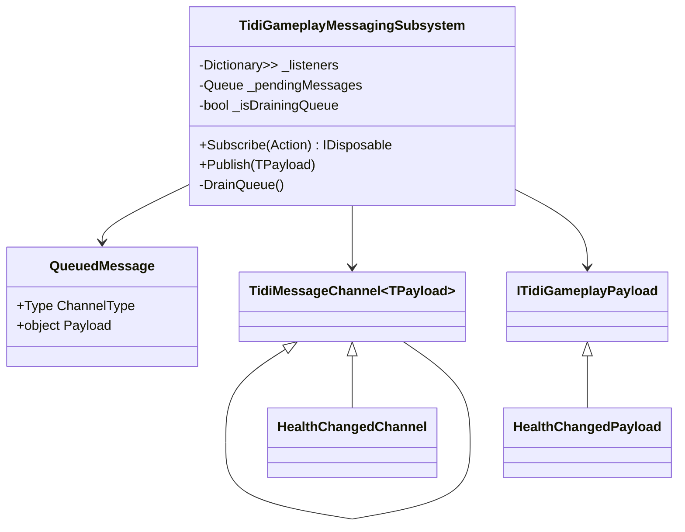

# Tidi Gameplay Messaging System

## Overview

The **Tidi Gameplay Messaging System** is a lightweight, decoupled communication framework designed to allow gameplay systems to interact without requiring direct references to one another. Instead of one system calling another directly, systems communicate through **message channels** and **payloads**.

The system follows a **publish–subscribe architecture**. In this pattern, systems that want to send information publish a message to a channel, while other systems can subscribe to that channel and react when a message is broadcast. This means that the publisher does not need to know which systems are listening, and listeners do not need to know who published the message.

This design significantly reduces coupling between systems and helps prevent tightly interconnected code, often referred to as “spaghetti code”.

---

## Core Concept

The messaging system is built around three primary concepts:

1. **Channels**
2. **Payloads**
3. **The Messaging Subsystem**

Channels act as **message identifiers**, payloads carry **data associated with a message**, and the messaging subsystem acts as the **central dispatcher** responsible for delivering messages to listeners.

Together, these components create a flexible system that allows many independent systems to communicate safely and efficiently.

---

## Messaging Subsystem

The `TidiGameplayMessagingSubsystem` is the central component responsible for handling message distribution. It maintains an internal registry of listeners and dispatches messages to them when a message is published.

Internally, the subsystem maintains several important data structures.

First, it contains a dictionary that maps **channel types to lists of listeners**. Each entry in this dictionary represents a channel and all the callbacks currently subscribed to that channel.

Second, the subsystem maintains a **message queue**. When a message is published, it is first placed in this queue instead of being immediately delivered to listeners.

Finally, the subsystem tracks whether it is currently processing the queue through a guard flag. This prevents re-entrant execution and ensures that message processing remains safe and deterministic.

This architecture ensures that messages are always processed in a controlled and predictable manner.

---

## Message Channels

Channels serve as **strongly typed identifiers** for messages. They represent a category of event that can occur in the game.

Channels are implemented as classes that inherit from the generic base type:

# TidiMessageChannel<TPayload>
Each channel defines the type of payload that it carries. The channel itself does not contain any logic or data; it simply defines the relationship between the channel and its payload.

For example, a health update message could be represented by a channel like: HealthChangedChannel : TidiMessageChannel<HealthChangedPayload>. This channel indicates that it carries payloads of type HealthChangedPayload.
The system uses the **channel type itself as the unique identifier**. Because of this, channels never need to be instantiated. The type alone is enough to route messages correctly.

This design mimics the concept of **gameplay tags or message channels used in modern game engines**.

---

## Payloads

Payloads are small data containers that carry the information associated with a message. They represent the actual data that listeners will receive when a message is broadcast.

Payloads are typically implemented as **structs** to minimize memory allocations and improve performance.

All payloads implement the `ITidiGameplayPayload` interface to enforce a common type constraint in the messaging system.

An example payload might look like this:
public struct HealthChangedPayload : ITidiGameplayPayload { public int CurrentHealth; public int MaxHealth; }
When a message is published, the payload instance is passed to every listener that subscribed to the corresponding channel.

---

## Subscribing to Messages

Systems that want to react to messages register themselves using the `Subscribe` method of the messaging subsystem.

When subscribing, the system specifies the channel it wants to listen to and provides a callback method that will be invoked whenever a message is published on that channel.

Internally, the subsystem wraps the callback into a generic delegate and stores it inside the listener registry.

Subscriptions return an `IDisposable` object. This allows the listener to safely unsubscribe from the channel when it no longer needs to receive messages.

This approach prevents memory leaks and ensures that listeners can be removed cleanly.

---

## Publishing Messages

Messages are broadcast through the `Publish` method of the messaging subsystem.

When a system publishes a message, the subsystem performs the following steps:

1. It determines the channel type associated with the message.
2. It packages the message payload and channel information into a queue entry.
3. It places that entry into the pending message queue.
4. If the system is not already processing messages, it begins draining the queue.

During queue processing, each queued message is dispatched to all listeners registered for the corresponding channel.

This ensures that every listener receives the message in the correct order.

---

## Message Queue and Safety

A critical design decision in this system is the use of a **message queue** rather than immediate dispatch.

Without a queue, several problems could occur:

- A listener might subscribe or unsubscribe while messages are being processed.
- A listener might publish another message while handling a message.
- The listener list could be modified while it is being iterated.

These situations can lead to runtime exceptions or unpredictable behavior.

To prevent this, the messaging subsystem processes messages through a queue and creates **snapshots of listener lists** before invoking callbacks.

This guarantees that modifications to subscriptions during message processing will not interfere with the current dispatch cycle.

---

## Deterministic Execution

Because messages are processed through a queue, the messaging system guarantees **deterministic message order**.

If multiple messages are published sequentially, they will always be processed in the same order they were published.

For example: Publish A Publish B Publish C.

Listeners will always receive the messages in this order: A, then B, then C.

This deterministic behavior is extremely important for gameplay systems where event ordering may affect game state.

---

## Decoupled System Communication

The messaging system allows completely independent systems to communicate without referencing one another.

For example, when a player kills an enemy, the combat system might publish an `EnemyKilled` message. Multiple systems may react to that event:

- The UI system updates the score display
- The audio system plays a sound effect
- The camera system triggers a visual effect
- The analytics system records the event

Each of these systems listens to the same message but operates independently.

This architecture makes the overall game code far more modular and easier to maintain.

---

## Architectural Advantages

The messaging system provides several important benefits.

Loose coupling allows systems to evolve independently without requiring changes in other parts of the codebase.

Scalability allows new systems to listen to existing messages without modifying the original publisher.

Flexibility allows multiple systems to react to the same event without coordination.

Safety mechanisms such as queued dispatch and listener snapshots prevent runtime errors caused by modifying collections during iteration.

Finally, strong typing ensures that payload types are validated at compile time, reducing the likelihood of runtime bugs.

---

## Summary

The Tidi Gameplay Messaging System provides a flexible and safe way for gameplay systems to communicate. By separating communication into **channels**, **payloads**, and a **central messaging subsystem**, the architecture promotes modular design and reduces direct dependencies between systems.

This approach is particularly useful for systems such as UI updates, gameplay reactions, audio triggers, camera effects, and analytics, where many independent systems may need to respond to the same event.

By leveraging strongly typed channels, lightweight payloads, and a queue-based dispatch mechanism, the system achieves both **high flexibility and runtime safety**, making it a powerful tool for managing cross-system communication in the game.