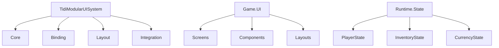
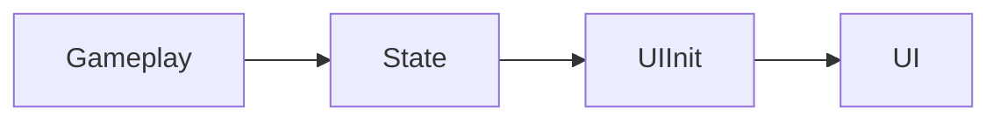
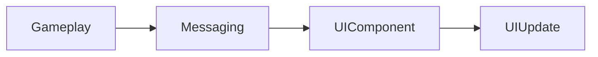
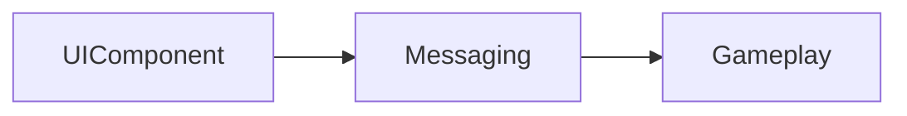
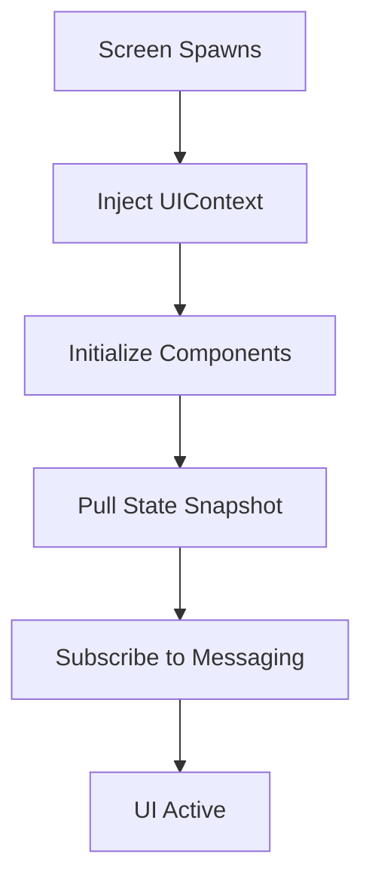

# TIDI Modular UI System — Full Architectural Specification (v3.0)

---

# 🚨 1. Problem Definition

Modern Unity UI systems (UGUI / naive UI Toolkit usage) suffer from fundamental architectural issues:

## ❌ 1.1 Tight Coupling
UI logic is often directly tied to gameplay logic:
- UI reads gameplay objects directly
- UI modifies gameplay state
- Systems become interdependent

---

## ❌ 1.2 Fragile Event Systems
Event-driven UI often fails due to:
- missed subscriptions
- incorrect initialization timing
- race conditions between UI spawn and gameplay state

---

## ❌ 1.3 No clear separation of responsibility
UI systems often mix:
- rendering
- state management
- gameplay logic
- animation control

---

## ❌ 1.4 Poor scalability
Adding new UI features increases dependency graph exponentially.

---

## ❌ 1.5 No reusable architecture
UI systems are:
- game-specific
- not portable
- not reusable across projects

---

# 🎯 2. System Goals

We aim to build a system that is:

- fully modular
- fully reactive
- completely decoupled from gameplay
- deterministic in state handling
- reusable across projects
- scalable to large UI systems

---

# 🧠 3. Core Philosophy

## 🧩 Separation of Concerns

| Layer         | Responsibility              |
|---------------|-----------------------------|
| Gameplay      | Authority (truth + rules)   |
| Runtime State | Snapshot of truth           |
| Messaging     | Event propagation           |
| UI System     | Rendering + interaction     |
| UI Components | Reactive presentation units |

---

## 🧠 Key Rule

UI NEVER owns truth  
UI ONLY reacts to truth

---

# 🏗️ 4. High-Level Architecture
Gameplay Systems ↓ Runtime State Modules ↓ Messaging System ↓ UI System (Core Engine) ↓ Game UI (Screens + Components)
---

# 📦 5. Assembly Structure

## 🔷 5.1 TidiModularUISystem (ENGINE LAYER)

Responsibilities:
- UI framework
- lifecycle management
- binding system
- layout system
- messaging integration

Contains:
- UIScreen
- UIComponent
- UILayout
- UIContext
- UIService

---

## 🔷 5.2 Game UI (CONTENT LAYER)

Responsibilities:
- game-specific UI implementation
- screens (HUD, menus)
- components (KillFeed, HealthBar, Shop)
- layouts usage

---

## 🔷 5.3 Runtime State (TRUTH LAYER)

Responsibilities:
- runtime snapshot of game state
- deterministic data source
- UI initialization source

Contains:
- PlayerState
- InventoryState
- CurrencyState
- GameSessionState

---

# 🗂️ 6. Folder / Architecture Map


---
🧱 7. Core Concepts
---
### 📺 Screen
A Screen is a dumb container layer

 Responsibilities:

 * organize components
 * define layout structure
 * manage lifecycle

 Does NOT:

 * contain gameplay logic
 * own state
---
## 🧠 UI Component
A UI Component is a **reactive worker**
Responsibilities:

* subscribe to state/messages
 * render UI
* emit intents
* 
Does NOT:
* modify gameplay state
* own authority
## 🧱 Layout
Pure structure system:
* positioning
* grouping
* flex behavior (UI Toolkit)
---
## 🔁 8. Data Flow Model
 **8.1 State Flow (Truth)**

**8.2 Event Flow (Updates)**


**8.3 Intent Flow (UI → Gameplay)**


---
## 🧬 9. Runtime State Modules
Purpose: Solve initial UI sync problem.
---
Problem: UI may subscribe too late → misses events
---
Solution: Always use a state snapshot
---
### Example: PlayerState
```csharp
public class PlayerState
{
    public int Health;
    public int MaxHealth;
    public int Coins;
}
```
---
Rule: State = truth snapshot
Messaging = updates

---
## ⚙️ 10. UI Initialization Flow


---
## 🧠 11. Namespace Architecture

**Engine Layer**

```csharp
namespace TidiModularUISystem.Core
namespace TidiModularUISystem.Binding
namespace TidiModularUISystem.Layout
namespace TidiModularUISystem.Integration
```
---
**Game UI Layer**
```csharp
namespace GAMENAME.UI.Screens
namespace GAMENAME.UI.Components
namespace GAMENAME.UI.Layouts
```

---
**Runtime State Layer**
```csharp
namespace GAMENAME.Runtime.State
```
---
🔥 12. What This System SOLVES
---
**✅ 12.1 Eliminates UI ↔ Gameplay coupling:**
UI never touches gameplay directly.
---
**✅ 12.2 Fixes timing issues:**
State snapshot prevents missed updates.
---
**✅ 12.3 Enables modular UI:**
Components are independent units.
---
**✅ 12.4 Enables React-like UI in Unity:**
* reactive components
* state-driven updates
---
**✅ 12.5 Reusable architecture:**
* portable across projects
* not game-specific
---
**✅ 12.6 Clean separation of concerns**


| System        | Role                        |
|---------------|-----------------------------|
| State         | Truth                       |
| Messaging     | Updates                     |
| UI Engine     | Structure                   |
| Game UI       | Content                     |
---
## 🚀 13. Final Vision
A Unity UI Toolkit-based reactive UI engine where:
- UI is fully decoupled from gameplay
- state is authoritative snapshot
- messaging drives updates
- UI components are reusable, reactive units
